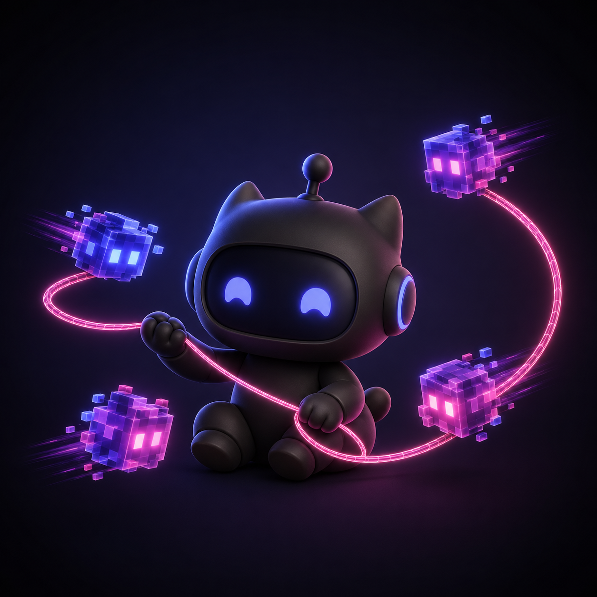
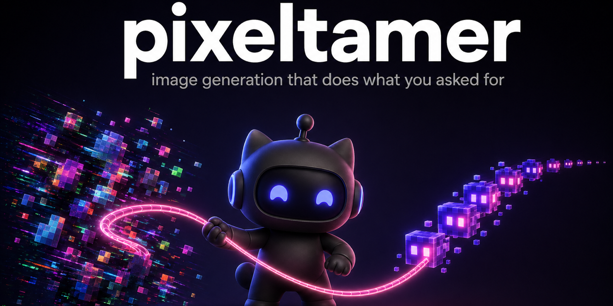
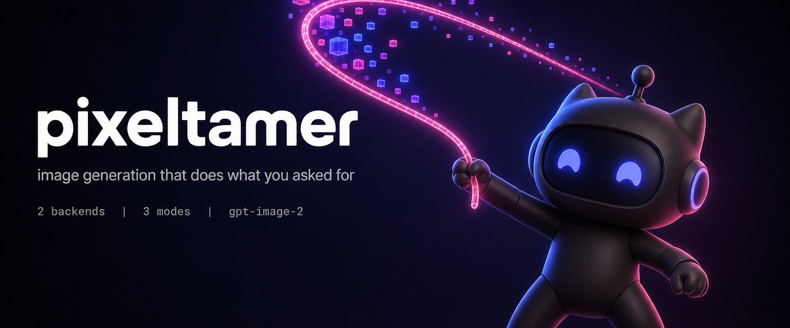
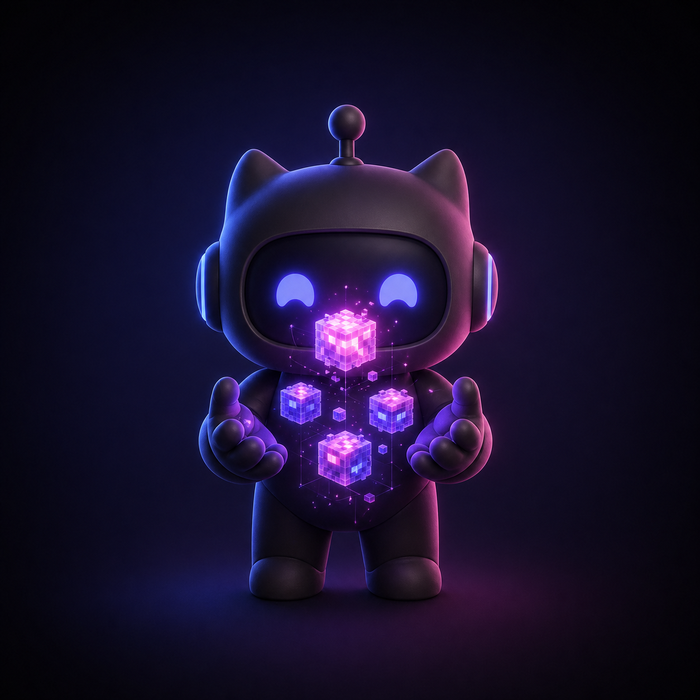
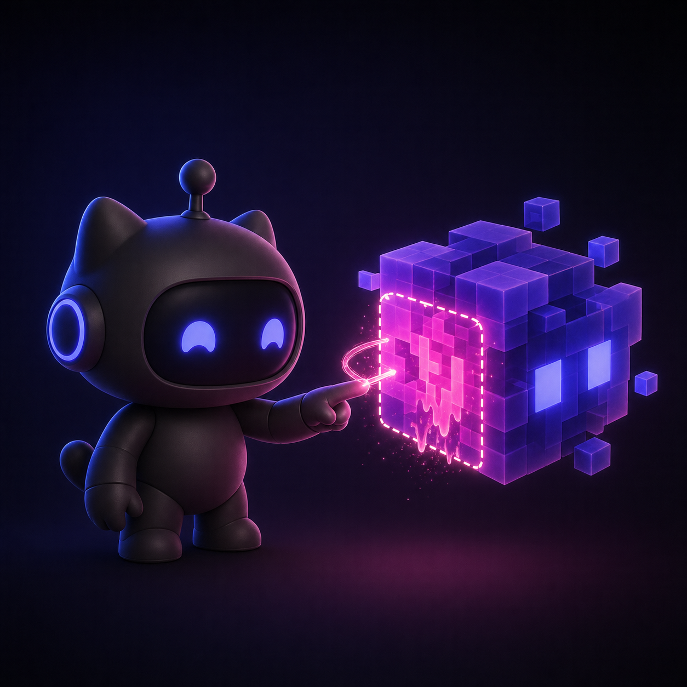
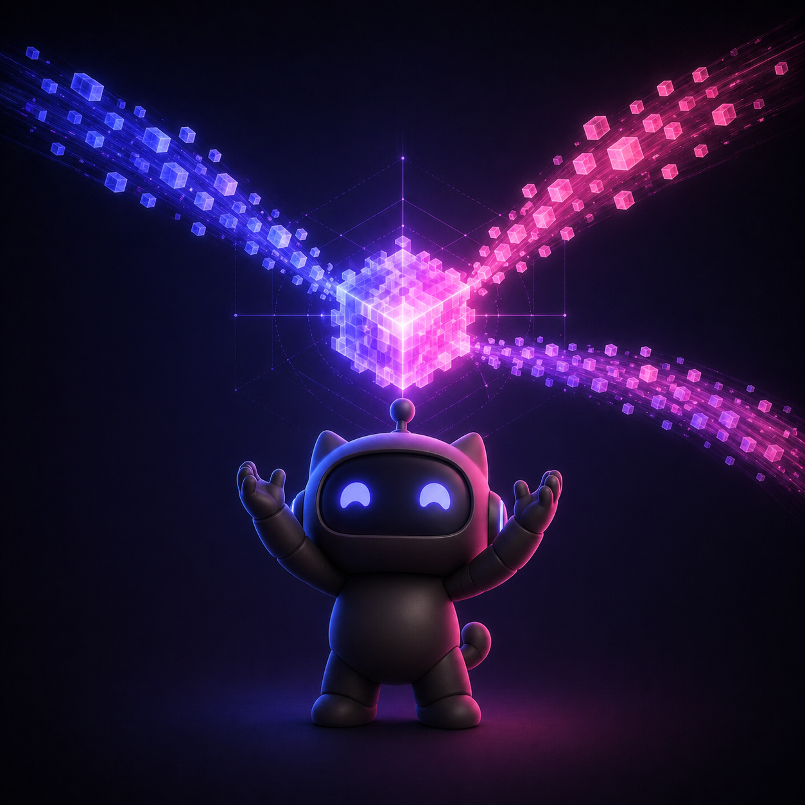
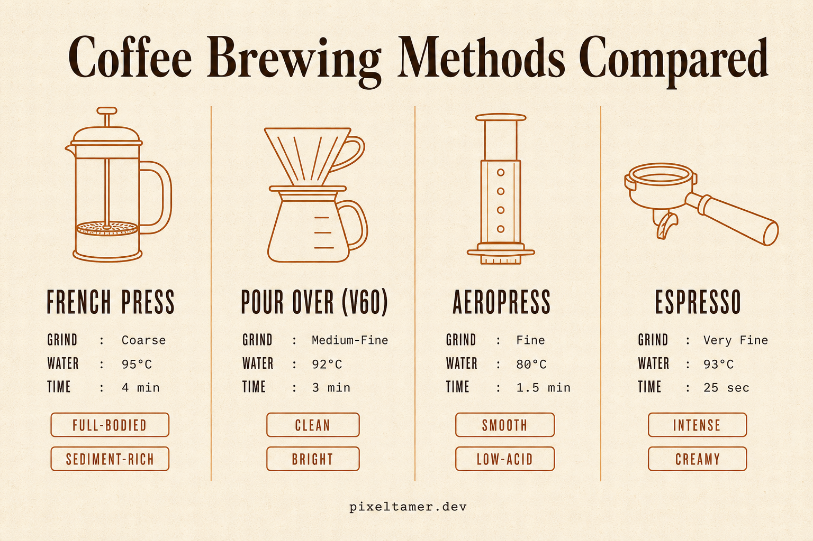

# pixeltamer gallery

Real images we built with pixeltamer, shipped with the **exact prompt** that produced each one. Copy any prompt below, drop it into your own `pixeltamer generate -p "..."` call, and you'll get something in the same family.

Each entry tags which patterns from [`references/prompt-patterns.md`](../references/prompt-patterns.md) it uses, so the gallery doubles as a worked-example index for the doctrine.

---

## How to read the metadata strips

Each entry has a strip like: `1024×1024 · codex · exact-typography · -i mascot.png`. Decoded:

| Tag | Meaning |
|---|---|
| `1024×1024` / `1536×1024` / etc. | Output dimensions before any post-crop |
| `codex` / `api` | Backend used to generate |
| `-i mascot.png` | Reference image attached for character/style consistency (codex `-i` flag) |
| `exact-typography` | [Habit #2 in `prompting.md`](../references/prompting.md): every text string in `"…"`, position+size+color spec |
| `JSON-schema` | [§1 in `prompt-patterns.md`](../references/prompt-patterns.md): structured 5-slot prompt |
| `role-opener` | [§2 in `prompt-patterns.md`](../references/prompt-patterns.md): `(Specialty) you are a ...` |
| `specific-negatives` | [§3 in `prompt-patterns.md`](../references/prompt-patterns.md): named-failure-mode negative list |
| `cropped-from` | This image was post-cropped with `sips` from the listed source dimensions |

---

## 1. Mascot — character mark



**Goal:** central character mark for the project — needed to work as a logo, app icon, and the visual anchor for every other piece in the gallery.

`1024×1024 · codex · prose-doctrine · single-character-on-clean-stage`

<details>
<summary>Show prompt</summary>

```
A cute chibi mascot character for an open-source developer tool called pixeltamer. Subject: a small rounded robot-creature, friendly and approachable, with a smooth matte-black body, glowing indigo cyan eyes (color #6366f1), sitting in a calm focused pose. The character is mid-action, holding a glowing wireframe lasso made of bright magenta-pink light (color #ec4899) that loops around three or four wild glitchy pixel-cubes which float around the character like fireflies being herded. The cubes have soft inner glow in indigo and pink tones, slight motion-blur trails behind them suggesting they were just caught. Composition: character centered, square crop, plenty of breathing room around the silhouette so it works as a logo or app icon. Background: a smooth dark radial gradient from deep near-black (#0f0f0f) at the corners to a slightly warmer near-black (#1a1a2e) toward the center, no other elements, no stars, no scenery, pure clean stage. Lighting: subtle rim light in indigo from upper-left, soft pink fill from lower-right, makes the character readable as a clean silhouette. Style: modern stylized 3D illustration with a soft matte finish, similar in feel to Discord or Linear brand mascots, slightly cartoony, clean linework where suggested, no photorealism, no painterly textures. The character should read as friendly and competent, not menacing. No text anywhere in the image. No watermarks. No UI elements. Single subject only.
```

</details>

---

## 2. Social preview — chaos → mascot → order, with brand text



**Goal:** GitHub repo social preview card — has to work as a thumbnail when shared on X/LinkedIn/Slack, with the wordmark + tagline rendered IN the image (not overlay).

`1280×640 · codex · cropped-from 1536×1024 · -i mascot.png · exact-typography · three-glances-test`

The mascot character holds across this image because of `-i mascot.png` attached as a reference. All three text strings ("pixeltamer", the tagline, the "gpt-image-2 · MIT" footer) rendered exactly as quoted on the first try.

<details>
<summary>Show prompt</summary>

```
A wide cinematic GitHub repository social preview card for an open-source image generation tool called pixeltamer. Canvas: landscape, dark editorial brand identity card.

LAYOUT (top to bottom):
- Upper third of frame: clean typography zone with generous breathing room
- Middle and lower portion: illustration zone with a chaos-to-order story

ILLUSTRATION (lower two-thirds, sitting BEHIND and BELOW the typography):
The same chibi mascot character from the attached reference image (rounded matte-black robot-creature with two cat-like ears tipped in soft pink, large glowing curved indigo eyes, smooth body, calm friendly silhouette) stands centered, slightly below frame center. To the mascot's left: a swirling cloud of glitchy multicolored pixel-cubes flying in disordered chaos with motion-blur trails and harsh digital noise — the visual mess of generic AI image slop. To the mascot's right: the same kind of pixel-cubes now lined up in a calm orderly arc, glowing softly in only indigo (#6366f1) and magenta (#ec4899). The mascot's outstretched arm holds a single glowing magenta-pink wireframe lasso of light arcing across the wide frame from chaos side to order side, visibly doing the work of taming.

EXACT TYPOGRAPHY (all English, crisp, large enough to read at thumbnail size, correctly spelled, no garbled characters, no extra characters anywhere except the quoted text):
- Wordmark: massive lowercase sans-serif, weight 800, color bright white (#ffffff), centered horizontally in the upper portion of the frame with comfortable margin from the top edge: "pixeltamer"
- Tagline: smaller sans-serif, weight 400, color light grey (#aaaaaa), centered horizontally directly below the wordmark with clean spacing: "image generation that does what you asked for"
- Tiny tag in the bottom-right corner of the illustration zone, monospace, dim grey (#666666), small but legible: "gpt-image-2 · MIT"

BACKGROUND: smooth dark radial gradient from deep near-black (#0f0f0f) at the corners to slightly warmer near-black (#1a1a2e) toward center. No other scenery, no stars, no scenery elements, pure clean stage.

LIGHTING: cool indigo rim light from upper-left, warm pink fill from lower-right, soft cinematic but restrained.

STYLE: modern stylized 3D illustration with a soft matte finish for the mascot and pixel-cubes, similar to Discord or Linear key-art. Typography is sharp, clean, vector-perfect. The frame should pass the three-glances test: glance one reads the wordmark, glance two reads the tagline and the chaos-to-order story, glance three notices the small tag.

CONSTRAINTS: render every text string exactly as written above, do not paraphrase, substitute, or invent additional text. No watermarks. No fake brand logos. No additional captions, labels, or copy beyond the three text blocks listed above. No UI chrome. Single character only. Match the character design, palette, and lighting of the attached reference image exactly.
```

</details>

---

## 3. Hero banner — left-aligned brand wordmark + mascot scene



**Goal:** README hero — wide cinematic frame, wordmark + tagline + stat strip on the left, mascot scene on the right.

`1536×640 · codex · cropped-from 1536×1024 · -i mascot.png · exact-typography · promotional-hierarchy`

Three text blocks ("pixeltamer", tagline, stat strip) all rendered exactly as quoted. The pipe-separator format `2 backends   |   3 modes   |   gpt-image-2` came back perfectly.

<details>
<summary>Show prompt</summary>

```
A wide cinematic README hero banner for an open-source image generation tool called pixeltamer. Canvas: landscape, dark editorial brand banner.

LAYOUT (left to right):
- Left half of frame: typography zone with generous breathing room, cleanly aligned to the left margin
- Right half: illustration zone with the mascot scene

ILLUSTRATION (right half of frame):
The same chibi mascot character from the attached reference image (rounded matte-black robot-creature with two cat-like ears tipped in soft pink, large glowing curved indigo eyes, smooth body) stands in a confident low-angle hero pose, one arm extended outward holding a glowing wireframe lasso of bright magenta-pink light. The lasso traces a single graceful arc toward the upper-left of the illustration zone, with a stream of glowing pixel-cubes following in disciplined order like a comet-tail being brought under control. The cubes glow only in indigo (#6366f1) and magenta (#ec4899). Plenty of negative space around the mascot.

EXACT TYPOGRAPHY (all English, crisp, correctly spelled, no garbled characters, no extra characters anywhere except the quoted text), all stacked left-aligned in the LEFT half of the frame with a clear vertical hierarchy:
- Wordmark, massive lowercase sans-serif, weight 800, color bright white (#ffffff), positioned in the upper-left region with comfortable margin: "pixeltamer"
- Tagline, sans-serif, weight 400, color light grey (#aaaaaa), directly below the wordmark with clean spacing: "image generation that does what you asked for"
- Three small monospace stat tags in a row below the tagline, dim white (#cccccc) numbers with grey (#666666) labels, separated by vertical bar dividers: "2 backends   |   3 modes   |   gpt-image-2"

BACKGROUND: smooth dark gradient from deep near-black (#0f0f0f) at corners to slightly warmer near-black (#1a1a2e) toward center. No other scenery, pure clean stage.

LIGHTING: cool indigo rim light from upper-left, warm pink fill from lower-right, cinematic but restrained.

STYLE: modern stylized 3D illustration with a soft matte finish for the mascot and pixel-cubes, similar to Discord or Linear key-art. Typography is sharp, clean, vector-perfect, sans-serif. Strong promotional hierarchy: wordmark dominant, tagline supporting, stat tags subtle.

CONSTRAINTS: render every text string exactly as written above, do not paraphrase, substitute, or invent additional text. No watermarks. No fake brand logos. No additional captions, labels, or copy beyond the three text blocks listed above. No UI chrome. Single character only. Match the character design, palette, and lighting of the attached reference image exactly.
```

</details>

---

## 4. Mode visual — generate



**Goal:** illustrate the *generate* mode (text → image) — mascot conjuring fresh pixel-cubes from empty space between its palms.

`1024×1024 · codex · -i mascot.png · single-action-pose · no-text`

<details>
<summary>Show prompt</summary>

```
A square illustration showing the GENERATE mode of an image-creation tool. Composition: the same chibi mascot character from the attached reference (rounded matte-black robot-creature with cat-like ears tipped in soft pink, large glowing curved indigo eyes, smooth body) stands centered, hands raised at chest height palms facing each other and slightly open. Between and above the mascot's hands, three to five fresh glowing pixel-cubes are visibly materializing out of thin air — light particles and sparkling motes streaming inward and condensing into solid cubes, with bright bloom around the topmost cube showing it just-formed. The cubes glow in indigo (#6366f1) and magenta (#ec4899) only. Faint geometric scaffold lines hint at the cubes assembling themselves from nothing. Background: clean dark gradient from #0f0f0f corners to #1a1a2e center, no scenery. Lighting: cool indigo rim from upper-left, warm pink fill from lower-right, soft glow from the forming cubes lights the mascot's face from above. Style: modern stylized 3D illustration with soft matte finish, like Discord or Linear key-art, clean readable silhouette, no photorealism, no painterly textures. Mood: a moment of creation, calm and almost ceremonial. No text, no watermarks, no UI, single character only. Match the character design, palette, and lighting of the attached reference exactly.
```

</details>

---

## 5. Mode visual — edit



**Goal:** illustrate the *edit* mode (modify one image, preserve everything else) — mascot precisely changing one face of an existing cube while the others stay the same.

`1024×1024 · codex · -i mascot.png · selection-marquee-pattern · contrast-via-isolation`

<details>
<summary>Show prompt</summary>

```
A square illustration showing the EDIT mode of an image-creation tool. Composition: the same chibi mascot character from the attached reference (rounded matte-black robot-creature with cat-like ears tipped in soft pink, large glowing curved indigo eyes, smooth body) stands slightly left of center. In the air directly in front of the mascot floats one large existing pixel-cube at eye level. The mascot extends one arm and points a single index finger at one specific face of the cube, and a thin precise glowing magenta-pink (#ec4899) lasso-thread wraps tightly around just that one face — that face is mid-color-change with a soft paint-melt effect, transitioning visibly from indigo to a brighter pink, while the other visible faces of the cube remain unchanged plain indigo (#6366f1). Soft particle wisps drift off the changing face. Around the cube, a faint dotted selection-marquee outlines only the targeted face, signalling 'precise change here, nothing else.' Background: clean dark gradient from #0f0f0f corners to #1a1a2e center, no scenery. Lighting: cool indigo rim light from upper-left, warm pink fill from lower-right, the changing face glows brightly enough to underlight the mascot's pointing hand. Style: modern stylized 3D illustration with soft matte finish, like Discord or Linear key-art, clean readable silhouette, no photorealism, no painterly textures. Mood: surgical precision, careful adjustment. No text, no watermarks, no UI, single character only. Match the character design, palette, and lighting of the attached reference exactly.
```

</details>

---

## 6. Mode visual — compose



**Goal:** illustrate the *compose* mode (blend 2–16 references into one) — mascot conducting two color-coded streams of cubes that converge and merge at a central node above.

`1024×1024 · codex · -i mascot.png · color-coded-flows · convergence-node`

<details>
<summary>Show prompt</summary>

```
A square illustration showing the COMPOSE mode of an image-creation tool. Composition: the same chibi mascot character from the attached reference (rounded matte-black robot-creature with cat-like ears tipped in soft pink, large glowing curved indigo eyes, smooth body) stands centered at the bottom, looking up with both arms gently raised in a conducting gesture. Above and around the mascot, three distinct streams of small glowing pixel-cubes flow inward from three different directions — one stream from upper-left, one from upper-right, one from far right horizon — each stream a steady arc of cubes with motion-blur trails. All three streams converge at a single bright central node directly above the mascot, where the cubes merge into one larger combined pixel-cube that glows brightest, freshly assembled from the inputs. The streams are color-coded by source: upper-left stream pure indigo (#6366f1), upper-right stream pure magenta (#ec4899), right stream a soft mix; the merged result cube glows in both colors blended. Faint guide lines or scaffolds suggest the merging geometry. Background: clean dark gradient from #0f0f0f corners to #1a1a2e center, no scenery. Lighting: cool indigo rim light from upper-left, warm pink fill from lower-right, dramatic glow at the convergence node lights the mascot's upturned face. Style: modern stylized 3D illustration with soft matte finish, like Discord or Linear key-art, clean readable silhouette, no photorealism, no painterly textures. Mood: orchestration, focused conducting. No text, no watermarks, no UI, single character only. Match the character design, palette, and lighting of the attached reference exactly.
```

</details>

---

## 7. Comparison infographic — Coffee Brewing Methods Compared



**Goal:** dense structured infographic with 4 columns × multiple labeled cells per column. Tests whether gpt-image-2 + the doctrine patterns can deliver a real comparison poster (not just decorative art).

`1536×1024 · codex · JSON-schema · role-opener · specific-negatives (15 named failure modes)`

Result: title "Coffee Brewing Methods Compared" rendered exactly. All 4 method names exact. All 12 spec values exact (Coarse / 95°C / 4 min … Very Fine / 93°C / 25 sec). All 8 taste pills exact. Footer "pixeltamer.dev" exact. Consistent line-art icon style across all 4 columns. Copper accent applied uniformly. Zero hallucinated content.

This entry exists partly as a worked-example for `references/prompt-patterns.md` — it stacks the JSON-config schema, role-based opener, and specific-negative block from §1, §2, §3.

> **Honest note on the JSON-schema A/B**: we generated this image twice on the codex backend — once with this JSON-schema prompt, once with an equivalent well-structured prose prompt of the same content. Both outputs were byte-identical (same MD5). Codex's image_gen reasoning loop appears to normalize prompts before calling gpt-image-2. The structural value of the JSON schema (input-side completeness, agent composability, scales to large prompts) still applies; the model-output delta isn't measurable through the codex backend. See `prompt-patterns.md` § 1 for the full caveat.

<details>
<summary>Show prompt (JSON-schema variant)</summary>

````
(Senior Editorial Information Designer) You are an information designer specialized in print-style comparison infographics. Portfolio reference: Pop Chart Lab, Information is Beautiful, Pentagram.

Generate a high-fidelity comparison infographic poster using the following spec:

{
  "type": "Comparison Infographic Poster",
  "topic": "Coffee Brewing Methods Compared",
  "audience": "Coffee enthusiasts at a specialty cafe",
  "structure": {
    "canvas": "1536x1024 landscape",
    "title_zone": "top centered, approximately 12% of canvas height",
    "comparison_zone": "4-column grid filling the middle 70% of canvas height",
    "footer_zone": "bottom centered, approximately 6% of canvas height, attribution only",
    "column_count": 4,
    "column_anatomy": "method icon at top, then method name, then 3 spec rows (label : value), then 2 taste-note tags"
  },
  "style": {
    "aesthetic": "specialty coffee-shop poster, editorial print",
    "background": "warm cream paper texture, base color #f5efe6",
    "primary_text": "dark espresso brown #2a1a10",
    "accent": "warm copper #b87333, used only on icons and column dividers",
    "typography": "serif display face for the title, condensed sans-serif for the column body, monospace for the spec values",
    "dividers": "thin vertical hairlines between columns in copper at low opacity",
    "icons": "minimalist single-weight line art, all four icons identical line weight and treatment"
  },
  "content": {
    "title": "Coffee Brewing Methods Compared",
    "footer": "pixeltamer.dev",
    "columns": [
      {
        "method": "French Press",
        "icon": "minimalist line-art of a French press cylinder with plunger",
        "specs": { "Grind": "Coarse", "Water": "95°C", "Time": "4 min" },
        "tastes": ["Full-bodied", "Sediment-rich"]
      },
      {
        "method": "Pour Over (V60)",
        "icon": "minimalist line-art of a V60 cone dripper on a carafe",
        "specs": { "Grind": "Medium-Fine", "Water": "92°C", "Time": "3 min" },
        "tastes": ["Clean", "Bright"]
      },
      {
        "method": "AeroPress",
        "icon": "minimalist line-art of an AeroPress with plunger inserted",
        "specs": { "Grind": "Fine", "Water": "80°C", "Time": "1.5 min" },
        "tastes": ["Smooth", "Low-acid"]
      },
      {
        "method": "Espresso",
        "icon": "minimalist line-art of an espresso portafilter handle and basket",
        "specs": { "Grind": "Very Fine", "Water": "93°C", "Time": "25 sec" },
        "tastes": ["Intense", "Creamy"]
      }
    ]
  },
  "constraints": "Render every text string exactly as written, no paraphrasing of method names, units, or taste notes. Every number and unit must appear exactly as quoted."
}

Constraints — do NOT include:
- Lorem ipsum or placeholder text
- Realistic photography of cups, beans, or coffee equipment (icons must be flat line-art only)
- Floating coffee beans, splashes, or decorative droplets
- 3D drop shadows, glossy gradients, or beveled edges
- Stock-photo coffee cups or barista hands
- Steam wisps, latte art, or other decorative atmospheric elements
- Mismatched icon styles between columns (all four icons must share identical line weight and treatment)
- Fake brand logos (no Hario, no Bialetti, no Aeropress logo etc.)
- Recipes, brewing instructions, or text blocks beyond the labeled cells
- Decorative borders, frames, or rounded boxes around columns
- A 5th or 6th method column beyond the four listed
- Different accent colors per column (the only accent is copper, used uniformly)
- A subtitle or sub-header beyond the title and footer
- Watermarks
- Burnt-paper or coffee-stain texture overlays
````

</details>

---

## Contributing your own

If you build something with pixeltamer that uses one of the doctrine patterns well, send a PR adding a new section here. Format: heading, image (under `gallery/images/` or `.github/assets/`), one-line goal, metadata strip, and the verbatim prompt in a `<details>` block. Match the existing entries.

The point of this page is to be a **prompt cookbook**, not a portfolio. Every entry should be runnable by a stranger who copies the prompt — keep them complete, keep them honest, don't edit them down to "look polished."
